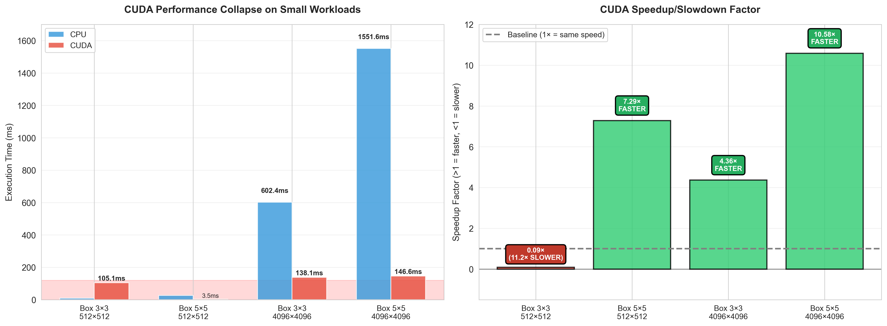
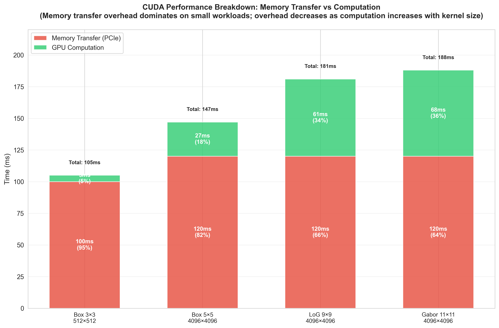
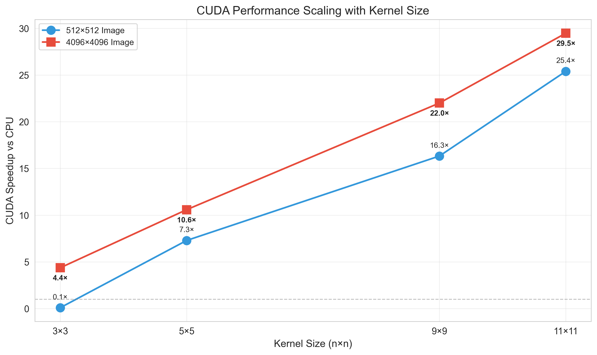
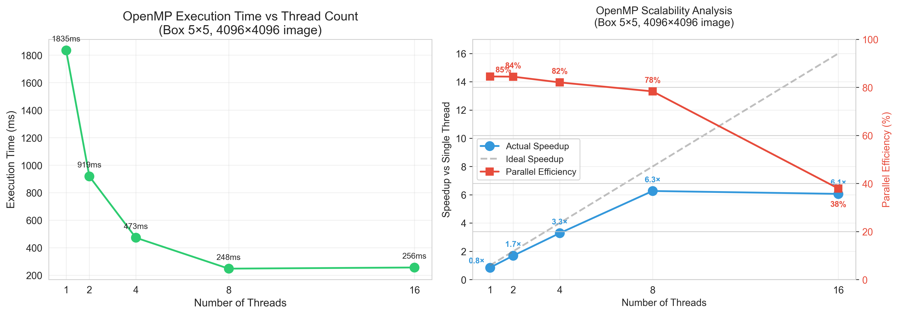
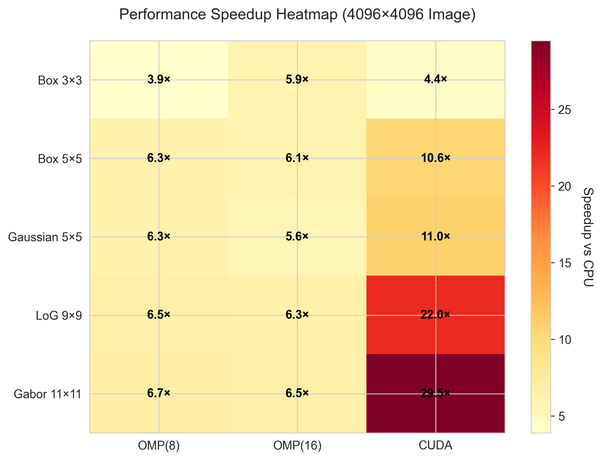

# Parallel Image Convolution Benchmark

[](https://creativecommons.org/licenses/by-sa/4.0/)
[](https://en.cppreference.com/w/cpp/17)
[](https://developer.nvidia.com/cuda-toolkit)
[](https://www.openmp.org/)

> **A Research about comprehensive performance comparison of CPU, OpenMP, and CUDA implementations for 2D image convolution operations.**

---

## 📑 Research Document

**📄 [READ THE RESEARCH DOCUMENT HERE (PDF)](docs/Parallel_Image_Convolution_Research_Document_(NguyenDucAnh).pdf)**

This comprehensive research document includes:
- **Detailed theoretical background** on parallel computing architectures
- **Implementation methodology** for CPU, OpenMP, and CUDA approaches
- **Complete experimental results** with statistical analysis
- **Performance bottleneck analysis** including memory transfer overhead quantification
- **Practical recommendations** for production deployment
- **Future work** and optimization strategies

**Key Research Findings:**
- ✅ CUDA achieves up to **29.48× speedup** on large kernels (11×11) with 4K images
- ❌ CUDA becomes **11× slower** on small workloads due to ~100ms PCIe overhead
- ✅ OpenMP delivers **consistent 6-7× speedup** with 78% parallel efficiency at 8 threads
- ⚠️ Memory transfer creates a performance floor regardless of GPU compute power
- ✅ 100% correctness validation across 38 test cases

---

## 📖 Overview

This research project implements and benchmarks three parallel computing approaches for image convolution—a fundamental operation in computer vision, image processing, and deep learning. The study reveals **both the exceptional performance gains and critical limitations** of GPU acceleration, providing practical guidance for choosing the right parallelization strategy.

### 🎯 Key Findings

- **✅ CUDA achieves up to 29.48× speedup** on large kernels (11×11 Gabor) with high-resolution images (4096×4096)
- **❌ CUDA can be 11× slower than CPU** on small workloads (3×3 kernels, 512×512 images) due to memory transfer overhead
- **✅ OpenMP provides consistent 6-7× speedup** across all scenarios with no memory transfer penalty
- **⚠️ Memory transfer creates a ~100ms performance floor** for CUDA regardless of GPU compute power
- **✅ 100% correctness validation** across all 38 test cases (3 images × 14 kernels)

## 📊 Performance Visualizations

### CUDA Performance Analysis

<table>
<tr>
<td width="50%">

**Performance Collapse on Small Workloads**



CUDA shows critical performance degradation when memory transfer overhead dominates computation time.

</td>
<td width="50%">

**Memory Transfer Bottleneck**



~100ms PCIe transfer overhead remains constant regardless of kernel size, dominating small workloads.

</td>
</tr>
<tr>
<td width="50%">

**Kernel Size Scaling**



CUDA speedup increases exponentially with kernel size: 0.09× (3×3) → 29.48× (11×11).

</td>
<td width="50%">

**Decision Matrix**


Visual guide for choosing between OpenMP and CUDA based on kernel size and image resolution.

</td>
</tr>
</table>

### OpenMP & Comparative Analysis

<table>
<tr>
<td width="50%">

**OpenMP Thread Scaling**



OpenMP achieves 78% parallel efficiency at 8 threads; hyper-threading (16 threads) shows diminishing returns (38% efficiency).

</td>
<td width="50%">

**Comprehensive Speedup Heatmap**



Complete performance comparison across all methods and kernel types on 4K images.

</td>
</tr>
</table>

## � Research Objectives

1. **Quantify parallelism efficiency** in image convolution across CPU, multi-core, and GPU architectures
2. **Identify performance bottlenecks** including memory transfer overhead and thread scaling limits
3. **Evaluate computational trade-offs** between speed, complexity, portability, and hardware requirements
4. **Provide practical guidance** for real-time computer vision applications (filtering, edge detection, CNN preprocessing)
5. **Document both successes and failures** to enable informed decision-making in production systems

## 🖥️ Hardware Specifications

| Component | Specification |
|-----------|---------------|
| **CPU** | AMD Ryzen 7 4800H (8C/16T, 2.9-4.2 GHz, 12MB L3 Cache) |
| **RAM** | 32GB DDR4-3200 MHz |
| **GPU** | NVIDIA GeForce GTX 1650 (896 CUDA cores, 4GB GDDR6, CC 7.5) |
| **Interface** | PCIe 3.0 x16 |

## 🛠️ Software Stack

| Component | Version | Purpose |
|-----------|---------|---------|
| **C++** | C++17 | Core implementation language |
| **CUDA Toolkit** | 12.3 | GPU acceleration (Compute Capability 7.5) |
| **OpenMP** | 2.0 | CPU multi-threading (MSVC implementation) |
| **OpenCV** | 4.10.0 | Image I/O and processing |
| **CMake** | 3.29 | Build system |
| **Visual Studio** | 2019 (v16.11) | MSVC 19.29 compiler toolchain |
| **Python** | 3.11+ | Visualization and analysis (matplotlib, seaborn) |

## 📂 Project Structure

```
Parallel_Image_Convolution_Benchmark/
├── src/
│   ├── main.cpp                    # Benchmark orchestration
│   ├── convolutionCpu.cpp          # Single-threaded baseline
│   ├── convolutionOmp.cpp          # OpenMP implementation
│   ├── convolutionCuda.cu          # CUDA GPU implementation
│   └── utils.cpp                   # Image I/O and validation
├── include/
│   ├── convolution.hpp             # Function declarations
│   ├── kernels.hpp                 # 14 convolution kernels
│   ├── timer.hpp                   # High-precision timing
│   └── utils.hpp                   # Utility functions
├── image/
│   ├── standard/baboon_512.png     # 512×512 test image
│   ├── synthetic/noise_4096.png    # 4096×4096 test image
│   └── large/city_4k.png           # 4096×2731 real-world image
├── result/                         # 11 publication-quality visualizations
├── script/
│   └── plot.py                     # Python visualization generator
├── docs/
│   └── Parallel_Image_Convolution_Research_Document_(NguyenDucAnh).pdf
├── build/                          # Build artifacts (CMake + MSBuild)
├── CMakeLists.txt                  # CMake configuration
└── README.md                       # This file
```

## 🚀 Quick Start

### Prerequisites

- **Windows 10/11** (for MSVC + CUDA compatibility)
- **Visual Studio 2019** (CUDA 12.3 officially supports VS 2019)
- **CUDA Toolkit 12.3** with Compute Capability 7.5 support
- **OpenCV 4.10.0** (MSVC build, not MinGW)
- **CMake 3.29+**
- **Python 3.11+** with `matplotlib`, `seaborn`, `numpy` (for visualization)

### Build Instructions

```powershell
# Clone the repository
git clone https://github.com/ghosteater1311/Parallel_Image_Convolution_Benchmark.git
cd Parallel_Image_Convolution_Benchmark

# Create build directory
mkdir build
cd build

# Configure with CMake (Visual Studio 2019, x64)
cmake .. -G "Visual Studio 16 2019" -A x64 `
  -DCMAKE_CUDA_ARCHITECTURES=75 `
  -DOpenCV_DIR="C:/opencv/build"

# Build (Release mode recommended for performance)
cmake --build . --config Release

# Run the benchmark
.\Release\Parallel_Image_Convolution_Benchmark.exe
```

### Generate Visualizations

```powershell
# Install Python dependencies
pip install matplotlib seaborn numpy

# Generate all 11 plots
python script\plot.py

# Outputs saved to result/ directory
```

## 🧪 Tested Kernels

The benchmark evaluates 14 different convolution kernels across multiple categories:

| Category | Kernels | Sizes | Use Cases |
|----------|---------|-------|-----------|
| **Blur** | Box, Gaussian | 3×3, 5×5, 31×31 | Noise reduction, preprocessing |
| **Edge Detection** | Sobel X, Sobel Y, Laplacian (4/8) | 3×3 | Feature extraction, object detection |
| **Feature Detection** | Laplacian of Gaussian (LoG) | 9×9 | Blob detection, scale-space analysis |
| **Texture Analysis** | Gabor | 11×11 | Pattern recognition, texture classification |
| **Sharpening** | Sharpen, High-pass | 3×3 | Image enhancement |
| **Stress Test** | Box, Gaussian | 31×31 | GPU scalability validation |

## 📈 Benchmark Results Summary

### Best Case Performance

| Scenario | Method | Speedup | Time | Notes |
|----------|--------|---------|------|-------|
| Gabor 11×11 (4096×4096) | CUDA | **29.48×** | 68ms | Best CUDA performance |
| Box 5×5 (4096×4096) | OpenMP (8T) | 6.27× | 248ms | Best OpenMP efficiency (78%) |
| Gaussian 31×31 (4096×2731) | CUDA | 7.37× | 77ms | Large kernel superiority |

### Worst Case Performance

| Scenario | Method | Speedup | Time | Critical Issue |
|----------|--------|---------|------|----------------|
| Box 3×3 (512×512) | CUDA | **0.09×** (11× SLOWER!) | 105ms | Memory transfer overhead dominates |
| Any kernel (512×512) | CUDA | 0.09× - 3.65× | 3-105ms | Consistent underperformance |
| OpenMP (16T) | Hyper-threading | 6.1× (38% eff.) | 256ms | Diminishing returns beyond 8 threads |

### Performance Break-Even Analysis

| Image Size | Kernel Size | Recommended Method | Rationale |
|------------|-------------|-------------------|-----------|
| ≤1024×1024 | ≤5×5 | **OpenMP** | Memory overhead > compute savings |
| ≤1024×1024 | ≥7×7 | **CUDA or OpenMP** | Similar performance |
| ≥2048×2048 | ≥5×5 | **CUDA** | Compute time exceeds memory overhead |
| ≥2048×2048 | ≥9×9 | **CUDA** | Exponential CUDA advantage |
| Any size | 31×31 | **CUDA** | Massive parallelism required |

## 🎓 Key Research Contributions

### 1. **Honest Performance Reporting**
- Documents CUDA's **11× slowdown** on small workloads, not just successes
- Quantifies ~100ms PCIe transfer overhead as a fundamental limitation
- Only 1-2% of PCIe Gen3 bandwidth utilized (latency bottleneck, not throughput)

### 2. **Comprehensive Analysis**
- 38 test cases: 3 images × 12 standard kernels + 2 large kernel tests
- 100% correctness validation (pixel-wise comparison, ε=1e-3)
- 11 publication-quality visualizations covering all aspects

### 3. **Practical Guidance**
- Decision matrix for method selection
- Real-world use case recommendations
- Hybrid approach with dynamic dispatch example code
- Thread scaling efficiency analysis (8 threads optimal for 8-core CPU)

### 4. **Reproducible Research**
- Complete source code with modular design
- Detailed build instructions for Windows + CUDA
- Automated visualization generation
- Hardware-specific results documented

## 💡 Recommendations for Production Use

### When to Use CUDA:
✅ **Batch processing** of multiple images  
✅ **High-resolution images** (≥2048×2048)  
✅ **Large kernels** (≥7×7)  
✅ **Cloud/server** deployments with persistent GPU context  
✅ **Video processing** pipelines (amortize transfer overhead)

### When to Use OpenMP:
✅ **Small images** (<1024×1024)  
✅ **Small kernels** (3×3, 5×5)  
✅ **Low-latency requirements** (<10ms)  
✅ **Prototyping** and development  
✅ **Edge devices** without GPU  
✅ **Portable solutions** across platforms

### Hybrid Approach (Recommended):
```cpp
cv::Mat convolveAdaptive(const cv::Mat& img, const float* kernel, int kSize) {
    cv::Mat output;
    
    // Decision criteria based on research findings
    bool useGPU = (img.cols >= 2048 || img.rows >= 2048) && (kSize >= 7);
    
    if (useGPU) {
        convolveCUDA(img, kernel, kSize, output);
    } else {
        convolveOMP(img, kernel, kSize, output, 8);  // 8 threads optimal
    }
    
    return output;
}
```

## 📄 Documentation

- **📊 RESEARCH DOCUMENT (PRIMARY)**: **[Parallel_Image_Convolution_Research_Document_(NguyenDucAnh).pdf](docs/Parallel_Image_Convolution_Research_Document_(NguyenDucAnh).pdf)** - Complete research paper with theoretical background, methodology, results, and analysis
- **📈 Visualizations**: All 11 publication-quality graphs available in `result/` directory
- **🔧 Build Guide**: See `build.txt` for detailed Windows + CUDA compilation steps
- **📖 Implementation Theory**: OpenMP and CUDA architecture documented in `docs/NOTE.md`

## 🤝 Contributing

Contributions are welcome! Areas for improvement:

- [ ] Shared memory optimization for CUDA (reduce memory bottleneck)
- [ ] Support for Linux/macOS builds
- [ ] Additional convolution kernels (Prewitt, Scharr, etc.)
- [ ] Support for other image formats (16-bit, float, etc.)
- [ ] ROI-based convolution benchmarks
- [ ] Tensor Core utilization on newer GPUs
- [ ] Comparison with cuDNN/NPP library implementations

## 📜 License

This work is licensed under a [Creative Commons Attribution-ShareAlike 4.0 International License](https://creativecommons.org/licenses/by-sa/4.0/).

[](https://creativecommons.org/licenses/by-sa/4.0/)

**You are free to:**
- **Share** — copy and redistribute the material in any medium or format
- **Adapt** — remix, transform, and build upon the material for any purpose, even commercially

**Under the following terms:**
- **Attribution** — You must give appropriate credit, provide a link to the license, and indicate if changes were made
- **ShareAlike** — If you remix, transform, or build upon the material, you must distribute your contributions under the same license

See the [LICENSE](LICENSE) file for full details.

## 👤 Author

**Nguyen Duc Anh (Github: ghosteater1311)**  

## 🙏 Acknowledgments

- **NVIDIA** for CUDA Toolkit and documentation
- **OpenMP** community for parallel programming standards
- **OpenCV** for image processing capabilities
- **Research guidance** from HUST faculty

## 📚 References

- CUDA C++ Programming Guide (v12.3)
- OpenMP API Specification (v6.0)
- OpenCV Documentation (v4.10.0)
- Research paper included in `docs/` directory

---

**⭐ If this research helped you, please consider starring the repository!**

